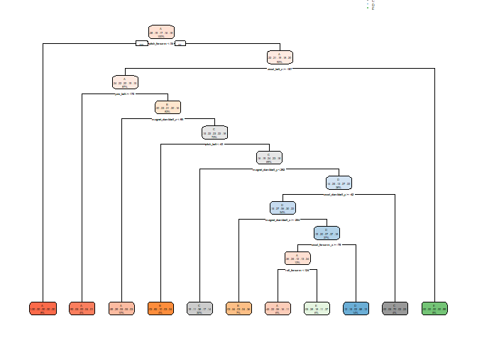
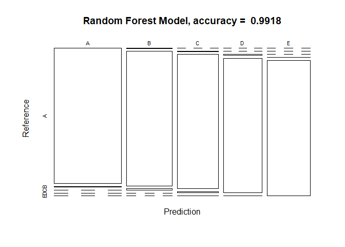
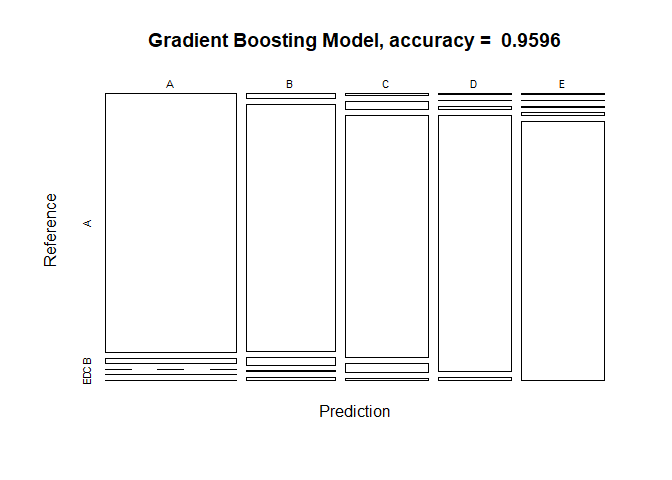

## Assessing Personal Activity using Quantified Self Movement Data

### Background

Devices like Jawbone Up, Nike FuelBand, and Fitbit can be used to cheaply collect large amounts of data about personal activity. These devices are used to quantify self movement by enthusiasts who take measurements of their own activity to improve their health, find patterns to their behaviour, or because they're tech geeks. Although people often quantify how much of an activity they do, they rarely quantify how well they do it. In this project, I'll use data from accelerometers placed on the belt, forearm, arm, and dumbell of six participants who were asked to perform barbell lifts correctly and incorrectly in five different ways. Additional information about this data and study can be found in the "Weight Lifting Exercise Dataset" at [this link](http://groupware.les.inf.puc-rio.br/har).

### Loading and Cleaning the Data

First, the required R-packages were loaded.


```r
library(caret)
```

```
## Warning: package 'caret' was built under R version 3.6.3
```

```
## Loading required package: lattice
```

```
## Warning: package 'lattice' was built under R version 3.6.3
```

```
## Loading required package: ggplot2
```

```
## Warning: package 'ggplot2' was built under R version 3.6.3
```

```r
library(rpart)
```

```
## Warning: package 'rpart' was built under R version 3.6.3
```

```r
library(rpart.plot)
```

```
## Warning: package 'rpart.plot' was built under R version 3.6.3
```

Next, the [training dataset](https://d396qusza40orc.cloudfront.net/predmachlearn/pml-training.csv) and [test dataset](https://d396qusza40orc.cloudfront.net/predmachlearn/pml-testing.csv) were downloaded from the [Human Activity Recognition project webpage](http://groupware.les.inf.puc-rio.br/har), who have generously allowed use of this data.


```r
train_url <- "http://d396qusza40orc.cloudfront.net/predmachlearn/pml-training.csv"
test_url <- "http://d396qusza40orc.cloudfront.net/predmachlearn/pml-testing.csv"

train_data <- read.csv(url(train_url))
test_data <- read.csv(url(test_url))

dim(train_data)
```

```
## [1] 19622   160
```

```r
dim(test_data)
```

```
## [1]  20 160
```

Next, I investigated a summary table of the variables in the training dataset **(although the detailed table is not shown here to save space)**.


Next, the training dataset was "cleaned", or pre-processed. As a first data cleaning step, I removed variables that have only NA values using a threshold of 95% in the training dataset (e.g., variables with more than 95% of entries as "NA" were removed). This removed 67 variables from the datasets.


```r
na_val_col <- sapply(train_data, function(x) mean(is.na(x))) > 0.95

train_data1 <- train_data[,na_val_col == FALSE]
test_data1 <- test_data[,na_val_col == FALSE]

dim(train_data1)
```

```
## [1] 19622    93
```

```r
dim(test_data1)
```

```
## [1] 20 93
```

The next data cleaning step was to remove all variables that have zero variance, or near zero variance, because the lack of variance in response means that the variable doesn't provide any useful means of differentiation amongst samples. This removed an additional 34 variables.


```r
non_zero_var <- nearZeroVar(train_data1)

train_data2 <- train_data1[,-non_zero_var]
test_data2 <- test_data1[,-non_zero_var]

dim(train_data2)
```

```
## [1] 19622    59
```

```r
dim(test_data2)
```

```
## [1] 20 59
```

The final data cleaning step was to remove non-numeric variables that didn't contribute to model development (the first 7 columns of data). This removed an additional 7 variables from the datasets.


```r
train_data3 <- train_data2[,8:59]
test_data3 <- test_data2[,8:59]

dim(train_data3)
```

```
## [1] 19622    52
```

```r
dim(test_data3)
```

```
## [1] 20 52
```

### Partitioning Training Dataset

The final cleaned version of the training dataset (train_data3) will be partitioned into two groups. One will be the training set (consisting of 60% of the dataset) and the other will be the test set (consisting of the remaining 40% of the dataset).


```r
inTrain <- createDataPartition(train_data3$classe, p= 0.6, list=FALSE)
train_fin <- train_data3[inTrain,]
test_fin <- train_data3[-inTrain,]

dim(train_fin)
```

```
## [1] 11776    52
```

```r
dim(test_fin)
```

```
## [1] 7846   52
```

### Model Development

The goal of this project is to predict the manner in which subjects did the exercise (the "classe" variable in the training set) using any of the other variables to make the prediction. We will try three models, and then select the one that does the best job of predicting the test dataset.

**1. Decision Tree Model**

Decision Tree Models use a series of splits to classify samples. These models are easy to interpret, but can be prone to overfitting and variable results. First, I'll apply the decision tree model to the training dataset.


```r
DTM_test <- train(classe ~., data = train_fin, method = "rpart")
```

Next, the decision tree model will be applied to the test dataset to assess its accuracy in predicting the variable "classe".


```r
DTM_predict <- predict(DTM_test, test_fin)
DTM_predict_conf <- confusionMatrix(DTM_predict, test_fin$classe)
DTM_predict_conf
```

```
## Confusion Matrix and Statistics
## 
##           Reference
## Prediction    A    B    C    D    E
##          A 1557  307   53  150   83
##          B   30  597   54   32  184
##          C  462  287 1130  371  410
##          D  160  163   31  674  147
##          E   23  164  100   59  618
## 
## Overall Statistics
##                                           
##                Accuracy : 0.5832          
##                  95% CI : (0.5722, 0.5942)
##     No Information Rate : 0.2845          
##     P-Value [Acc > NIR] : < 2.2e-16       
##                                           
##                   Kappa : 0.4749          
##                                           
##  Mcnemar's Test P-Value : < 2.2e-16       
## 
## Statistics by Class:
## 
##                      Class: A Class: B Class: C Class: D Class: E
## Sensitivity            0.6976  0.39328   0.8260   0.5241  0.42857
## Specificity            0.8944  0.95259   0.7638   0.9236  0.94597
## Pos Pred Value         0.7242  0.66555   0.4248   0.5736  0.64108
## Neg Pred Value         0.8815  0.86746   0.9541   0.9083  0.88027
## Prevalence             0.2845  0.19347   0.1744   0.1639  0.18379
## Detection Rate         0.1984  0.07609   0.1440   0.0859  0.07877
## Detection Prevalence   0.2740  0.11433   0.3390   0.1498  0.12287
## Balanced Accuracy      0.7960  0.67294   0.7949   0.7239  0.68727
```

The accuracy of this model is 58.32%, **and therefore the out-of-sample error is (100 - 58.32 = ) 41.68%.** The model results can also be plotted as follows:


```r
rpart.plot(DTM_test$finalModel, roundint = FALSE)
```

<!-- -->

**2. Random Forest Model**

Random Forest Models build regression trees on bootstrapped samples, making a diverse set of potential trees that can then be averaged. This generally produces a very accurate result. First, I'll apply the random forest model to the training dataset.


```r
RFM_test <- train(classe ~., data = train_fin, method = "rf", ntree = 100)
```

Next, the random forest model will be applied to the test dataset to assess its accuracy in predicting the variable "classe".


```r
RFM_predict <- predict(RFM_test, test_fin)
RFM_predict_conf <- confusionMatrix(RFM_predict, test_fin$classe)
RFM_predict_conf
```

```
## Confusion Matrix and Statistics
## 
##           Reference
## Prediction    A    B    C    D    E
##          A 2231   14    0    0    0
##          B    1 1501   14    0    0
##          C    0    3 1344   14    2
##          D    0    0   10 1270    4
##          E    0    0    0    2 1436
## 
## Overall Statistics
##                                           
##                Accuracy : 0.9918          
##                  95% CI : (0.9896, 0.9937)
##     No Information Rate : 0.2845          
##     P-Value [Acc > NIR] : < 2.2e-16       
##                                           
##                   Kappa : 0.9897          
##                                           
##  Mcnemar's Test P-Value : NA              
## 
## Statistics by Class:
## 
##                      Class: A Class: B Class: C Class: D Class: E
## Sensitivity            0.9996   0.9888   0.9825   0.9876   0.9958
## Specificity            0.9975   0.9976   0.9971   0.9979   0.9997
## Pos Pred Value         0.9938   0.9901   0.9861   0.9891   0.9986
## Neg Pred Value         0.9998   0.9973   0.9963   0.9976   0.9991
## Prevalence             0.2845   0.1935   0.1744   0.1639   0.1838
## Detection Rate         0.2843   0.1913   0.1713   0.1619   0.1830
## Detection Prevalence   0.2861   0.1932   0.1737   0.1637   0.1833
## Balanced Accuracy      0.9985   0.9932   0.9898   0.9927   0.9978
```

The accuracy of this model is 99.18% **and therefore the out-of-sample error is (100 - 99.18 = ) 0.82%.**. The model results can also be plotted as follows:


```r
plot(RFM_predict_conf$table, col = RFM_predict_conf$byClass, main = paste("Random Forest Model, accuracy = ", round(RFM_predict_conf$overall['Accuracy'], 4)))
```

<!-- -->

**3.Gradient Boosting Model**

Gradient Boosting Models takes a large number of (possibly) weak predictors, and weights them in a way that takes advantage of their strengths to create stronger predictors. This generally produces a very accurate result. First, I'll apply the gradient boosting model to the training dataset..


```r
GBM_test <- train(classe ~., data = train_fin, method = "gbm", verbose = FALSE)
GBM_test$finalModel
```

```
## A gradient boosted model with multinomial loss function.
## 150 iterations were performed.
## There were 51 predictors of which 51 had non-zero influence.
```

Next, the gradient boosting model will be applied to the test dataset to assess its accuracy in predicting the variable "classe".


```r
GBM_predict <- predict(GBM_test, test_fin)
GBM_predict_conf <- confusionMatrix(GBM_predict, test_fin$classe)
GBM_predict_conf
```

```
## Confusion Matrix and Statistics
## 
##           Reference
## Prediction    A    B    C    D    E
##          A 2187   39    0    1    2
##          B   29 1432   44    5   20
##          C    9   43 1305   47   15
##          D    3    1   16 1218   18
##          E    4    3    3   15 1387
## 
## Overall Statistics
##                                          
##                Accuracy : 0.9596         
##                  95% CI : (0.955, 0.9638)
##     No Information Rate : 0.2845         
##     P-Value [Acc > NIR] : < 2.2e-16      
##                                          
##                   Kappa : 0.9489         
##                                          
##  Mcnemar's Test P-Value : 1.817e-07      
## 
## Statistics by Class:
## 
##                      Class: A Class: B Class: C Class: D Class: E
## Sensitivity            0.9798   0.9433   0.9539   0.9471   0.9619
## Specificity            0.9925   0.9845   0.9824   0.9942   0.9961
## Pos Pred Value         0.9812   0.9359   0.9197   0.9697   0.9823
## Neg Pred Value         0.9920   0.9864   0.9902   0.9897   0.9915
## Prevalence             0.2845   0.1935   0.1744   0.1639   0.1838
## Detection Rate         0.2787   0.1825   0.1663   0.1552   0.1768
## Detection Prevalence   0.2841   0.1950   0.1809   0.1601   0.1800
## Balanced Accuracy      0.9862   0.9639   0.9682   0.9707   0.9790
```

The accuracy of this model is 95.96%, **and therefore the out-of-sample error is (100 - 95.96 = ) 4.04%.**. The model results can also be plotted as follows:


```r
plot(GBM_predict_conf$table, col = GBM_predict_conf$byClass, main = paste("Gradient Boosting Model, accuracy = ", round(GBM_predict_conf$overall['Accuracy'], 4)))
```

<!-- -->

### Conclusion

The out-of-sample error of the decision tree model was the highest at 41.68%. The out-of-sample error of the gradient boosting model was 4.04%, and the out-of-sample error of the random forest model was the lowest at 0.82%. We will therefore use the random forest model to predict the classification of the 20 test cases in the "test_data3" file.

## Classification of 20 Test Cases


```r
test_data3_prediction <- predict(RFM_test, test_data3)
test_data3_prediction
```

```
##  [1] B A B A A E D B A A B C B A E E A B B B
## Levels: A B C D E
```
